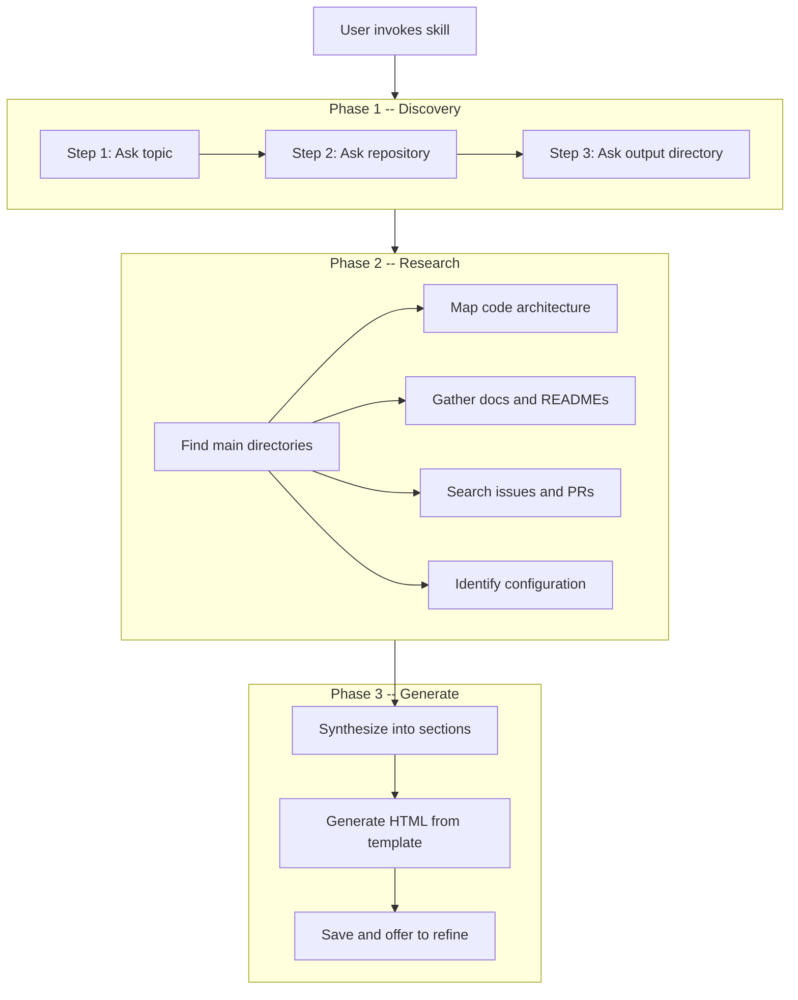

# skill-deep-dive

An [agent skill](https://skills.sh) that researches any topic inside a GitHub repository and generates a polished, self-contained HTML reference document. Point it at a feature and a repo, and it will explore the codebase — architecture, key files, types, issues, PRs — then synthesize everything into a browsable deep-dive page you can open in any browser.

## Install

```bash
npx skills add davethegut/cursor-skill-deep-dive
```

Works with [Cursor](https://cursor.com), [Claude Code](https://code.claude.com), [Codex](https://developers.openai.com/codex), [Windsurf](https://windsurf.com), [Cline](https://cline.bot), [GitHub Copilot](https://github.com/features/copilot), [Roo Code](https://roocode.com), and [40+ other agents](https://skills.sh/docs/cli).

## How It Works

The skill runs a **5-step research pipeline** — interactive discovery, parallel codebase research, synthesis into structured sections, HTML generation from a template, and delivery.



The research phase runs searches in parallel when possible — code architecture, documentation, issues/PRs, and configuration are gathered concurrently. When a local clone is available, the skill prefers local file reads over GitHub API calls for speed.

## What Gets Researched

The skill explores 5 categories of information from the target repository:

| # | Category | What It Gathers |
|---|----------|----------------|
| 1 | **Directory mapping** | Plugin/package structure, key subdirectories, entry points, manifest files |
| 2 | **Code architecture** | Public API surfaces, type definitions, route handlers, service boundaries, data flow |
| 3 | **Documentation** | README files, architecture decision records, CONTRIBUTING guides, inline design comments |
| 4 | **Issues & PRs** | Open epics, design discussions, recently merged PRs, feature direction |
| 5 | **Configuration** | Feature flags, config schemas, environment variables, setup instructions |

## Output Sections

Findings are synthesized into up to 8 structured sections (the skill skips sections that don't apply and adds custom ones when the topic warrants it):

| Section | Content |
|---------|---------|
| **Overview** | What it is, what problem it solves, who uses it |
| **Architecture** | Key components, how they connect, data flow with HTML diagrams |
| **Key Files & Directories** | Table of important paths with descriptions |
| **How It Works** | Step-by-step walkthrough of the primary execution flow |
| **Key Concepts & Types** | Important interfaces, types, enums, constants |
| **Configuration & Setup** | How to enable, configure, and run locally |
| **Related Issues & PRs** | Table of relevant GitHub activity with links |
| **Further Reading** | Links to READMEs, external docs, related features |

## Prerequisites

- **`gh` CLI** — installed and authenticated. Verify with `gh auth status`.
- **Local clone** (optional) — if the repo is cloned in the workspace, the skill uses local file reads instead of API calls for faster, more thorough research.

## Installation

### Via skills.sh (recommended)

```bash
npx skills add davethegut/cursor-skill-deep-dive
```

The CLI auto-detects which agents you have installed and offers to install to each one. Use flags for non-interactive installation:

```bash
# Install to a specific agent
npx skills add davethegut/cursor-skill-deep-dive -a cursor -y

# Install globally (available to all projects)
npx skills add davethegut/cursor-skill-deep-dive -g

# Install to all detected agents
npx skills add davethegut/cursor-skill-deep-dive --all
```

### Manual installation

Clone the repo and copy into your agent's skills directory:

```bash
git clone https://github.com/davethegut/cursor-skill-deep-dive.git

# Cursor
cp -r cursor-skill-deep-dive ~/.cursor/skills/skill-deep-dive

# Claude Code
cp -r cursor-skill-deep-dive ~/.claude/skills/skill-deep-dive

# Or any agent's skills directory
```

### Verify installation

Confirm that `SKILL.md` is readable at the installed path and that `template.html` is in the same directory.

## Usage

Ask the skill to research a topic in a repo. It will ask you to confirm the topic, repository, and output directory before starting.

### Explore a feature in a large repo

```
Deep dive into Attack Discovery in elastic/kibana
```

### Learn about a library's internals

```
Teach me about the router in remix-run/remix
```

### Research a specific plugin or package

```
I want to learn about the plugin lifecycle in elastic/kibana
```

### Generate a reference doc

```
Generate a reference doc for the detection rules engine in elastic/kibana
```

### What to Expect

1. The skill asks what topic, which repo, and where to save
2. It searches the codebase for relevant directories, files, types, and documentation
3. It gathers related issues and PRs for historical context
4. It synthesizes findings into structured sections
5. It generates a self-contained HTML page from the template
6. You receive the file path and an offer to refine or expand sections

## Output Format

Deep-dives are generated as self-contained HTML files. See [`examples/sample-deep-dive-output.html`](examples/sample-deep-dive-output.html) for a complete example. Each page includes:

- **Dark theme** — GitHub-dark aesthetic that automatically switches to a light theme when printed
- **Table of contents** — anchor links for quick navigation
- **Structured sections** — up to 8 sections with tables, code blocks, flow diagrams, and callout boxes
- **Repository metadata** — header shows the repo name and generation date
- **No external dependencies** — works offline, shareable as a single file

Default output directory: `./deep-dives/` (configurable when the skill runs).

## Customizing the Template

Edit [`template.html`](template.html) to change the look and feel. The template uses CSS custom properties at the top — adjust colors, fonts, or spacing there:

```css
:root {
  --bg: #0d1117;        /* Page background */
  --surface: #161b22;   /* Card/code background */
  --border: #30363d;    /* Borders */
  --text: #e6edf3;      /* Primary text */
  --text-muted: #8b949e; /* Secondary text */
  --accent: #58a6ff;    /* Links, headings, badges */
}
```

The skill replaces these placeholders when generating a page:

| Placeholder | Description |
|-------------|-------------|
| `{{BADGE}}` | Short category label (e.g., "Deep Dive") |
| `{{TITLE}}` | Page title |
| `{{SUBTITLE}}` | One-line description |
| `{{TOPIC}}` | Topic name (used in filename and footer) |
| `{{REPO}}` | Repository (e.g., `elastic/kibana`) |
| `{{GENERATED_DATE}}` | Date in YYYY-MM-DD format |
| `{{CONTENT}}` | All synthesized sections as HTML |

## Limitations

- **Does not execute code.** It reads and analyzes source files — it does not run tests, build projects, or execute scripts.
- **Does not replace reading the source.** The deep-dive is a starting point for understanding, not a substitute for working with the code directly.
- **Quality depends on the repo.** Well-documented repos with READMEs, typed interfaces, and clear structure produce better deep-dives. Sparse repos yield thinner output.
- **GitHub API rate limits apply.** For repos without a local clone, the skill uses `gh` CLI which is subject to GitHub's rate limits. Large explorations may need a local clone.
- **Single-topic focus.** Each invocation researches one topic. For broad codebase overviews, run multiple deep-dives on different areas.

## Repository Structure

```
├── SKILL.md              # Main skill definition — workflow, research steps, synthesis structure
├── AGENTS.md             # Claude Code / Codex compatibility layer
├── template.html         # Self-contained HTML output template with all CSS inline
└── examples/
    └── sample-deep-dive-output.html   # Example of a generated deep-dive page
```

## License

[MIT](LICENSE)
